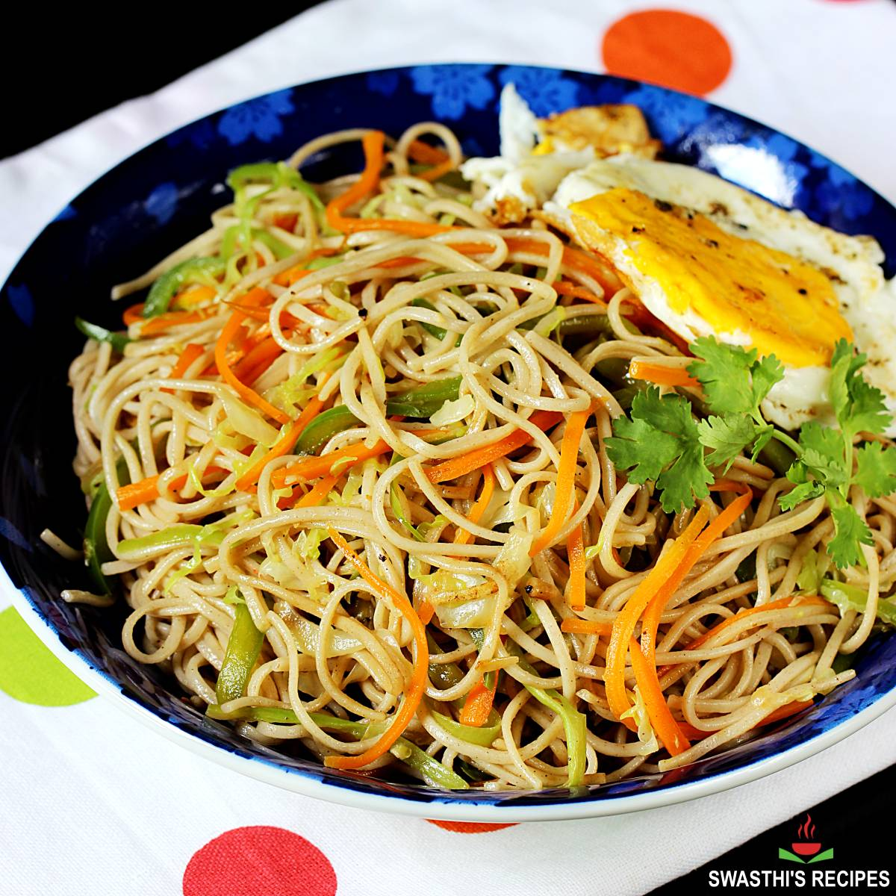

### EX NO: 04

# <p align="center">Commercial website using HTML & CSS</P>

## Aim:
To create a responsive and visually appealing website for Delicious Restaurant.

## Algorithm:

Step 1: Add the appropriate HTML structure for the web pages, including the header, main
content, and footer sections.

Step 2: Include the necessary CSS file (style.css) and external font stylesheets (Teko and Tilt
Prism) for custom typography.

Step 3: Define the basic styles for the body, such as setting the font family and
margin/padding to zero.

Step 4: Style the header section by setting a background color (#9d9898), adding padding,
and using the desired font styles.

Step 5: Structure the navigation bar by creating an unordered list and setting it to
display inline-block.
  
Step 6: Apply styles to the navigation bar links (<a>) to define their appearance and add
hover effects.
  
Step 7: Center-align the navigation bar by using the justify-content: center property on the
nav element.
  
Step 8: Set the maximum width of the main content section to 900px and center-align it
using margin: 0 auto.
  
Step 9: Add padding to the main content section to create space around the content.
Step 10: Create styles for images to ensure they are responsive and fit within the designated
dimensions.
  
Step 11: Style the footer section with a background color (#333), white text color, and
center-align the text.
  
Step 12: Customize specific elements for the home page, such as setting the font size for
headings and paragraphs, and adding background color.
  
Step 13: Define styles for the contact form, including aligning the form elements and
adjusting the input and textarea styles.
  
Step 14: Create a separate CSS block for the content section, setting it to display as a block,
with a width of 90% and transparent background.
  
Step 15: Adjust the background image properties to ensure it covers the content area and
remains centered.


## Program

### index.html
```html
<html lang="en">

<head>
    <meta charset="UTF-8" />
    <meta http-equiv="X-UA-Compatible" content="IE=edge" />
    <meta name="viewport" content="width=device-width, initial-scale=1.0" />
    <title>Restraunt</title>
    <link rel="stylesheet" href="https://cdnjs.cloudflare.com/ajax/libs/font-awesome/5.15.3/css/all.min.css" />
    <link rel="stylesheet" href="assests/css/style.css" />
</head>

<body>
    <nav class="navbar">
        <div class="navbar-container">
            
            <ul class="menu-items">
                <li><a href="#home">Home</a></li>
                <li><a href="#about">About</a></li>
                <li><a href="#food">Category</a></li>
                <li><a href="#food-menu">Menu</a></li>
                <li><a href="#testimonials">Testimonial</a></li>
                <li><a href="#contact">Contact</a></li>
            </ul>
            <h1 class="logo">Foodie Hub</h1>
        </div>
    </nav>
    <section class="showcase-area" id="showcase">
        <div class="showcase-container">
            <h1 class="main-title" id="home">ENTER THE LAND OF SPICES</h1>
            <p>Have your mouth jumping from our spices???</p>
            <a href="#food-menu" class="btn btn-primary">Menu</a>
        </div>
    </section>
    
    
    <section id="about">
        <div class="about-wrapper container">
            <div class="about-text">
                <p class="small">About Us</p>
                <h2>We've beem making healthy food last for 10 years</h2>
                <p>
                    “In a world that is increasingly coming closer, we seek to promote the harmony of Indian culture, cuisine and architecture. As a fast-growing Indian company in various countries, it is our commitment to live up to our nation’s promise to give the best to the world. We strive to set benchmarks in various aspects of our businesses in Food, Hospitality, Hoteliering and Real Estate.”
                </p>
            </div>
            <div class="about-img">
                
            </div>
        </div>
    </section>
    <section id="food">
        <h2>Types of food</h2>
        <div class="food-container container">
            <div class="food-type fruite">
                <div class="img-container">
                    
                    <div class="img-content">
                        <h3>Chinese Cuisine</h3>
                        <a href="https://en.wikipedia.org/wiki/Chinese_cuisine" class="btn btn-primary" target="blank">learn more</a>
                    </div>
                </div>
            </div>
            <div class="food-type vegetable">
                <div class="img-container">
                    
                    <div class="img-content">
                        <h3>American Cuisine</h3>
                        <a href="https://en.wikipedia.org/wiki/American_cuisine#:~:text=American%20cuisine%20consists%20of%20the,many%20other%20cultures%20and%20traditions." class="btn btn-primary" target="blank">learn
                            more</a>
                    </div>
                </div>
            </div>
            <div class="food-type grin">
                <div class="img-container">
                    
                    <div class="img-content">
                        <h3>Indian Cuisine</h3>
                        <a href="https://en.wikipedia.org/wiki/Indian_cuisine" class="btn btn-primary" target="blank">learn
                            more</a>
                    </div>
                </div>
            </div>
        </div>
    </section>
    <section id="food-menu">
        <h2 class="food-menu-heading">Food Menu</h2>
        <div class="food-menu-container container">
            <div class="food-menu-item">
                <div class="food-img">
                    
                </div>
                <div class="food-description">
                    <h2 class="food-titile">Biriyani</h2>
                    <p>
                        Biryani is nothing but, just a state of happiness.
                    </p>
                    <p class="food-price">Price: &#8377; 250</p>
                </div>
            </div>

            <div class="food-menu-item">
                <div class="food-img">
                    
                </div>
                <div class="food-description">
                    <h2 class="food-titile">Burger</h2>
                    <p>
                        Hungry? Try Our Burgers Made with Half Pound Patties.
                    </p>
                    <p class="food-price">Price: &#8377; 250</p>
                </div>
            </div>
            <div class="food-menu-item">
                <div class="food-img">
                    
                </div>
                <div class="food-description">
                    <h2 class="food-titile">Chicken Fried Rice</h2>
                    <p>
                        Better Than Plain Rice!.Get Egg-cited With This Fried Rice!
                    </p>
                    <p class="food-price">Price: &#8377; 250</p>
                </div>
            </div>
            <div class="food-menu-item">
                <div class="food-img">
                    
                </div>
                <div class="food-description">
                    <h2 class="food-titile">Pizza</h2>
                    <p>
                        Pizza first, any second. It's not just pizza. It's a habit. On bad days, call pizza.
                    </p>
                    <p class="food-price">Price: &#8377; 250</p>
                </div>
            </div>
            <div class="food-menu-item">
                <div class="food-img">
                    
                </div>
                <div class="food-description">
                    <h2 class="food-titile">Noodles</h2>
                    <p>
                        Delicious than you imagine. Nothing can replace its taste. Makes your stomach feel good.
                    </p>
                    <p class="food-price">Price: &#8377; 250</p>
                </div>
            </div>
            <div class="food-menu-item">
                <div class="food-img">
                    
                </div>
                <div class="food-description">
                    <h2 class="food-titile">Veg Meals</h2>
                    <p>
                        Don't ask me why I'm a vegetarian-ask yourself why you're not.
                    </p>
                    <p class="food-price">Price: &#8377; 250</p>
                </div>
            </div>
        </div>
    </section>
    <section id="testimonials">
        <h2 class="testimonial-title">What Our Customers Say</h2>
        <div class="testimonial-container container">
            <div class="testimonial-box">
                <div class="customer-detail">
                    <div class="customer-photo">
                        
                        <p class="customer-name">Ross Lee</p>
                    </div>
                </div>
                <div class="star-rating">
                    <span class="fa fa-star checked"></span>
                    <span class="fa fa-star checked"></span>
                    <span class="fa fa-star checked"></span>
                    <span class="fa fa-star checked"></span>
                    <span class="fa fa-star checked"></span>
                </div>
                <p class="testimonial-text">
                    This place is great! Atmosphere is chill and cool but the staff is also really friendly. They know what they’re doing and what they’re talking about, and you can tell making the customers happy is their main priority. Food is pretty good, some italian classics and some twists, and for their prices it’s 100% worth it.
                </p>

            </div>
            <div class="testimonial-box">
                <div class="customer-detail">
                    <div class="customer-photo">
                        
                        <p class="customer-name">Amelia Watson</p>
                    </div>
                </div>
                <div class="star-rating">
                    <span class="fa fa-star checked"></span>
                    <span class="fa fa-star checked"></span>
                    <span class="fa fa-star checked"></span>
                    <span class="fa fa-star checked"></span>
                    <span class="fa fa-star checked"></span>
                </div>
                <p class="testimonial-text">
                    I have to say, I enjoyed every single bite of the meal in (RN). I had a 3 course meal, with a couple of beers. Considering the quality, the price is reasonable. Ideal for those who want a romantic night out. There was also plenty of room for bigger groups.
                </p>

            </div>
            <div class="testimonial-box">
                <div class="customer-detail">
                    <div class="customer-photo">
                        
                        <p class="customer-name">Ben Roy</p>
                    </div>
                </div>
                <div class="star-rating">
                    <span class="fa fa-star checked"></span>
                    <span class="fa fa-star checked"></span>
                    <span class="fa fa-star checked"></span>
                    <span class="fa fa-star checked"></span>
                    <span class="fa fa-star checked"></span>
                </div>
                <p class="testimonial-text">
                    Excellent food. Menu is extensive and seasonal to a particularly high standard. Definitely fine dining. It can be expensive but worth it and they do different deals on different nights so it’s worth checking them out before you book. Highly recommended.
                </p>

            </div>
        </div>
    </section>
    <section id="contact">
        <div class="contact-container container">
            <div class="contact-img">
                
            </div>

            <div class="form-container">
                <h2>Contact Us</h2>
                <input type="text" placeholder="Your Name" />
                <input type="email" placeholder="E-Mail" />
                <textarea cols="30" rows="6" placeholder="Type Your Message"></textarea>
                <a href="#" class="btn btn-primary">Submit</a>
            </div>
        </div>
    </section>
    <footer id="footer">
        <h2>Restaurant &copy; all rights reserved</h2>
    </footer>
    <!-- .................../ JS Code for smooth scrolling /...................... -->

    <script src="https://ajax.googleapis.com/ajax/libs/jquery/3.3.1/jquery.min.js"></script>
    <script src="assests/js/script.js"></script>


</html>

</body>

</html>


```

### style.css
```css
@import url("https://fonts.googleapis.com/css2?family=Poppins:ital,wght@0,300;0,400;0,500;0,600;0,700;0,800;0,900;1,200;1,300;1,400;1,500;1,600;1,700;1,800;1,900&display=swap");

*,
*::after,
*::before {
  box-sizing: border-box;
  padding: 0;
  margin: 0;
}

.html {
  font-size: 62.5%;
}

body {
  font-family: "Poppins", sans-serif;
}


.container {
  max-width: 1200px;
  width: 90%;
  margin: auto;
}

.btn {
  display: inline-block;
  padding: 0.5em 1.5em;
  text-decoration: none;
  border-radius: 50px;
  outline: none;
  margin-top: 1em;
  text-transform: uppercase;
  font-weight: small;
}

.btn-primary {
  color: #fff;
  background: #16a083;
}

.btn-primary:hover {
  background: #117964;
}


.navbar {
  box-shadow: 0px 5px 10px 0px #aaa;
  position: fixed;
  width: 100%;
  background: #fff;
  color: #000;
  opacity: 0.85;
  height: 50px;
  
}

.navbar-container {
  display: flex;
  justify-content: space-between;
  height: 64px;
  align-items: center;
}

.menu-items {
  order: 2;
  display: flex;
}

.menu-items li {
  list-style: none;
  margin-left: 1.5rem;
  margin-bottom: 0.5rem;
  font-size: 1.2rem;
}

.menu-items a {
  text-decoration: none;
  color: #444;
  font-weight: 500;
}

.menu-items a:hover {
  color: #117964;
}

.logo {
  order: 1;
  font-size: 2.3rem;
  margin-bottom: 0.5rem;
}


.showcase-area {
  height: 50vh;
  background: linear-gradient(
      rgba(240, 240, 240, 0.144),
      rgba(255, 255, 255, 0.336)
    ),
    url("https://i.postimg.cc/Nj4f6gZs/res2.jpg");
  
  background-size: cover;
  background-position: center;
  background-repeat: no-repeat;
}

.showcase-container {
  display: flex;
  flex-direction: column;
  align-items: center;
  justify-content: center;
  height: 100%;
  font-size: 1.6rem;
}

.main-title {
  text-transform: uppercase;
  margin-top: 1.5em;
}


#about {
  padding: 50px 0;
  background: #f5f5f7;
}

.about-wrapper {
  display: flex;
  flex-wrap: wrap;
}

#about h2 {
  font-size: 2.3rem;
}

#about p {
  font-size: 1.2rem;
  color: #555;
}

#about .small {
  font-size: 1.2rem;
  color: #666;
  font-weight: 600;
}

.about-img {
  flex: 1 1 400px;
  padding: 30px;
  transform: translateX(150%);
  animation: about-img-animation 1s ease-in-out forwards;
}

@keyframes about-img-animation {
  100% {
    transform: translate(0);
  }
}

.about-text {
  flex: 1 1 400px;
  padding: 30px;
  margin: auto;
  transform: translate(-150%);
  animation: about-text-animation 1s ease-in-out forwards;
}

@keyframes about-text-animation {
  100% {
    transform: translate(0);
  }
}

.about-img img {
  display: block;
  height: 400px;
  max-width: 100%;
  margin: auto;
  object-fit: cover;
  object-position: right;
}


#food {
  padding: 5rem 0 10rem 0;
}

#food h2 {
  text-align: center;
  font-size: 2.5rem;
  font-weight: 400;
  margin-bottom: 40px;
  text-transform: uppercase;
  color: #555;
}

.food-container {
  display: flex;
  justify-content: space-between;
}

.food-container img {
  display: block;
  width: 100%;
  margin: auto;
  max-height: 300px;
  object-fit: cover;
  object-position: center;
}

.img-container {
  margin: 0 1rem;
  position: relative;
}

.img-content {
  position: absolute;
  top: 70%;
  left: 50%;
  transform: translate(-50%, -50%);
  opacity: 0;
  z-index: 2;
  text-align: center;
  transition: all 0.3s ease-in-out 0.1s;
}

.img-content h3 {
  color: #fff;
  font-size: 2.2rem;
}

.img-content a {
  font-size: 1.2rem;
}

.img-container::after {
  content: "";
  display: block;
  position: absolute;
  top: 0;
  left: 0;
  width: 100%;
  height: 100%;
  background: rgba(0, 0, 0, 0.871);
  opacity: 0;
  z-index: 1;

  transform: scaleY(0);
  transform-origin: 100% 100%;
  transition: all 0.3s ease-in-out;
}

.img-container:hover::after {
  opacity: 1;
  transform: scaleY(1);
}

.img-container:hover .img-content {
  opacity: 1;
  top: 40%;
}


.food-menu-heading {
  text-align: center;
  font-size: 3.4rem;
  font-weight: 400;
  color: #666;
}

.food-menu-container {
  display: flex;
  flex-wrap: wrap;
  padding: 50px 0px 30px 0px;
}

.food-menu-container img {
  display: block;
  width: 250px;
  height: 250px;
  border-radius: 50%;
  object-fit: cover;
  object-position: center;
}

.food-menu-item {
  display: flex;
  flex: 1 1 600px;
  justify-content: space-evenly;
  margin-bottom: 3rem;
}

.food-description {
  margin: auto 1.5rem;
}

.font-title {
  font-size: 1.8rem;
  font-weight: 400;
  color: #444;
}

.food-description p {
  font-size: 1.4rem;
  color: #555;
  font-weight: 500;
}

.food-description .food-price {
  color: #117964;
  font-weight: 700;
}


#testimonials {
  padding: 5rem 0;
  background: rgba(243, 243, 243);
}

.testimonial-title {
  text-align: center;
  font-size: 2.8rem;
  font-weight: 400;
  color: #555;
}

.testimonial-container {
  display: flex;
  justify-content: space-between;
  font-size: 1.4rem;
  padding: 1rem;
}

.testimonial-box .checked {
  color: #ff9529;
}

.testimonial-box .testimonial-text {
  margin: 1rem 0;
  color: #444;
}

.testimonial-box {
  text-align: center;
  padding: 1rem;
}

.customer-photo img {
  display: block;
  width: 150px;
  height: 150px;
  object-fit: cover;
  object-position: center;
  border-radius: 50%;
  margin: auto;
}


#contact {
  padding: 5rem 0;
  background: rgb(226, 226, 226);
}

.contact-container {
  display: flex;
  background: #fff;
}

.contact-img {
  width: 50%;
}

.contact-img img {
  display: block;
  height: 400px;
  width: 100%;
  object-position: center;
  object-fit: cover;
}

.form-container {
  padding: 1rem;
  width: 50%;
  margin: auto;
}

.form-container input {
  display: block;
  width: 100%;
  border: none;
  border-bottom: 2px solid #ddd;
  padding: 1rem 0;
  box-shadow: none;
  outline: none;
  margin-bottom: 1rem;
  color: #444;
  font-weight: 500;
}

.form-container textarea {
  display: block;
  width: 100%;
  border: none;
  border-bottom: 2px solid #ddd;
  color: #444;
  outline: none;
  padding: 1rem 0;
  resize: none;
}

.form-container h2 {
  font-size: 2.7rem;
  font-weight: 500;
  color: #444;
  margin-bottom: 1rem;
  margin-top: -1.2rem;
}

.form-container a {
  font-size: 1.3rem;
}

#footer h2 {
  text-align: center;
  font-size: 1.8rem;
  padding: 2.6rem;
  font-weight: 500;
  color: #fff;
  background: rgb(65, 65, 65);
}


@media (max-width: 768px) {
  .navbar {
    opacity: 0.95;
  }

  .navbar-container input[type="checkbox"],
  .navbar-container .hamburger-lines {
    display: block;
  }

  .navbar-container {
    display: block;
    position: relative;
    height: 64px;
  }

  .navbar-container input[type="checkbox"] {
    position: absolute;
    display: block;
    height: 32px;
    width: 30px;
    top: 20px;
    left: 20px;
    z-index: 5;
    opacity: 0;
  }

  .navbar-container .hamburger-lines {
    display: block;
    height: 23px;
    width: 35px;
    position: absolute;
    top: 17px;
    left: 20px;
    z-index: 2;
    display: flex;
    flex-direction: column;
    justify-content: space-between;
  }

  .navbar-container .hamburger-lines .line {
    display: block;
    height: 4px;
    width: 100%;
    border-radius: 10px;
    background: #333;
  }

  .navbar-container .hamburger-lines .line1 {
    transform-origin: 0% 0%;
    transition: transform 0.4s ease-in-out;
  }

  .navbar-container .hamburger-lines .line2 {
    transition: transform 0.2s ease-in-out;
  }

  .navbar-container .hamburger-lines .line3 {
    transform-origin: 0% 100%;
    transition: transform 0.4s ease-in-out;
  }

  .navbar .menu-items {
    padding-top: 100px;
    background: #fff;
    height: 100vh;
    max-width: 300px;
    transform: translate(-150%);
    display: flex;
    flex-direction: column;
    margin-left: -40px;
    padding-left: 50px;
    transition: transform 0.5s ease-in-out;
    box-shadow: 5px 0px 10px 0px #aaa;
  }

  .navbar .menu-items li {
    margin-bottom: 1.5rem;
    font-size: 1.3rem;
    font-weight: 500;
  }

  .logo {
    position: absolute;
    top: 5px;
    right: 15px;
    font-size: 5rem;
  }

  .navbar-container input[type="checkbox"]:checked ~ .menu-items {
    transform: translateX(0);
  }

  .navbar-container input[type="checkbox"]:checked ~ .hamburger-lines .line1 {
    transform: rotate(35deg);
  }

  .navbar-container input[type="checkbox"]:checked ~ .hamburger-lines .line2 {
    transform: scaleY(0);
  }

  .navbar-container input[type="checkbox"]:checked ~ .hamburger-lines .line3 {
    transform: rotate(-35deg);
  }

  /* ......./ food /......... */

  .food-container {
    flex-direction: column;
    align-items: stretch;
  }

  .food-type:not(:last-child) {
    margin-bottom: 3rem;
  }

  .food-type {
    box-shadow: 5px 5px 10px 0 #aaa;
  }

  .img-container {
    margin: 0;
  }
}

@media (max-width: 500px) {
  html {
    font-size: 65%;
  }

  .navbar .menu-items li {
    font-size: 1.6rem;
  }

  .testimonial-container {
    flex-direction: column;
    text-align: center;
  }

  .food-menu-container img {
    margin: auto;
  }

  .food-menu-item {
    flex-direction: column;
    text-align: center;
  }

  .form-container {
    width: 90%;
  }

  .contact-container {
    display: flex;
    flex-direction: column;
  }

  .contact-img {
    width: 90%;
    margin: 3rem auto;
  }

  .logo {
    position: absolute;
    top: 06px;
    right: 15px;
    font-size: 3rem;
  }

  .navbar .menu-items li {
    margin-bottom: 2.5rem;
    font-size: 1.8rem;
    font-weight: 500;
  }
}

@media (min-width: 769px) and (max-width: 1200px) {
  .img-container h3 {
    font-size: 1.5rem;
  }

  .img-container .btn {
    font-size: 0.7rem;
  }
}

@media (orientation: landscape) and (max-height: 500px) {
  .showcase-area {
    height: 50vmax;
  }
}

```

## Output


## Result
Thus we Successfully created Commercial Website using HTML & CSS
